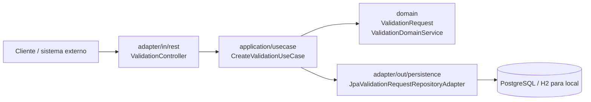

# Arquitetura do primeiro incremento

## Visão geral

O primeiro incremento do VALAAS define a base do `validator-service` com uma separação em camadas que respeita a arquitetura hexagonal.

## Camadas

- `domain`: modelos e regras básicas do processo de validação.
- `application`: casos de uso e portas de entrada/saída.
- `adapter/in/rest`: contratos HTTP para criação e consulta de validações.
- `adapter/out/persistence`: persistência para a solicitação de validação.

## Fluxo funcional

1. O cliente envia uma solicitação de validação.
2. O controller converte o payload em um comando de aplicação.
3. O caso de uso valida regras de domínio.
4. A solicitação é persistida.
5. O cliente recebe a resposta com identificador do pedido.

## Próximos incrementos

- PostgreSQL real com Flyway e migrations;
- Mensageria NATS JetStream;
- worker assíncrono de processamento;
- cache Valkey;
- observabilidade com Actuator + Micrometer + Prometheus;
- segurança com OAuth2/OIDC e autorização multi-tenant.
